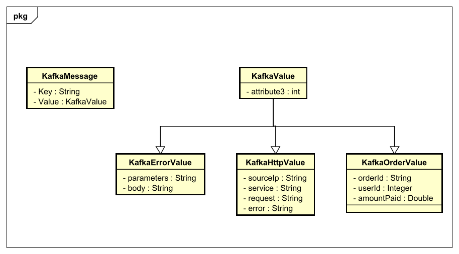
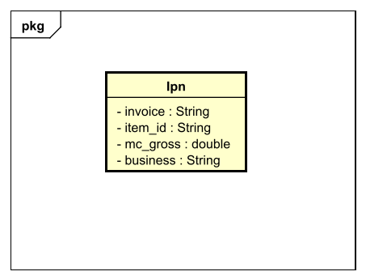
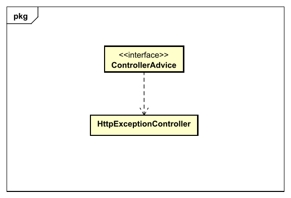
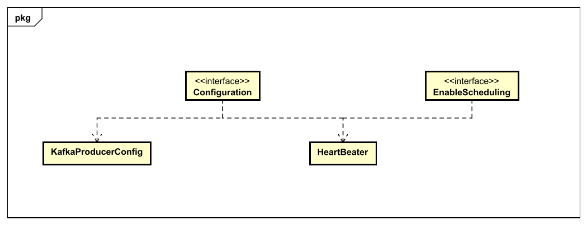
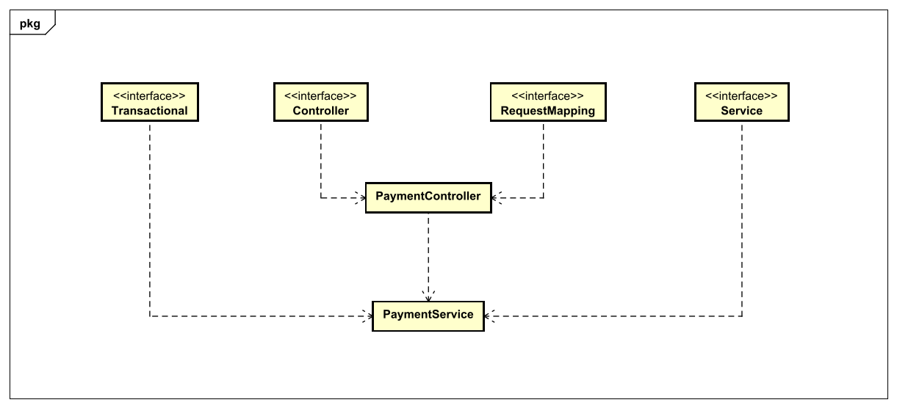

# Progetto "3A" Caruso&Fallica DSBD 2020

<p align="center" style="font-size: 24px">
  <span> Italiano </span> |
  <a href="https://github.com/Krytons/Progetto3ACarusoFallicaDSBD/blob/main/README.md">English</a>
</p>

## Progetto di Distributed Systems Big Data 2020
### A cura di:
- **Caruso Bartolomeo**
- **Giuseppe Fallica**

## 1. Aim of this project
Questo progetto mira a creare un microservizio che verrà utilizzato per gestire i pagamenti in una applicazione distribuita di e-commerce.

Gli da noi utilizzati per la realizzazione del progetto sono stati:
- **Database MySql:** database relazionale utilizzato all’interno di un container Docker
- **Sistema di messaggistica Kafka:** piattaforma di streaming di eventi distribuita open source, utilizzata per pubblicare in un argomento specifico, errori e informazioni sui dati critici.
- **Spring framework:** un framework open source utilizzato per sviluppare applicazioni basate su Java.
- **Apache Maven:** uno strumento di gestione e comprensione dei progetti.

### Come testare il nostro
- **Avviare Docker:**
  ```bash
    $ docker start
  ```
- **Creare un file .env dentro "Progetto3ACarusoFallicaDSBD" con i seguenti argomenti:**
  ```dotenv
    DB_DATABASE = #Your DB name
    DB_USER = #Your DB user
    DB_PASSWORD = #Your DB password
    DB_ROOT_PASSWORD = #Your DB root password
    DB_HOST = #Your DB host name
    DB_PORT = #Your DB port number
    PAYMENT_MANAGER_HOST = #Host name of payment microservice, we used "paymentmanager"
    PAYMENT_MANAGER_PORT = #Payment microservice port
    MY_PAYPAL_ACCOUNT = #Receiver business mail, we used "merchange@mydomain.tld"
    HEART_BEAT_PERIOD = #Period of the heartbeating routine expressed in ms
    HEART_BEAT_URL_PING = #URL that will be used by the heartbeating routine for the POST request.
  ```

- **Aprire il terminale all'interno del "Progetto3ACarusoFallicaDSBD" ed usare il seguente comando:**
  ```bash  
  $ docker-compose up -build
  ```

---

## 2. POJO classes
In order to easily generate messages and JSON data, we've used the following POJO classes:
- **Kafka Message & Kafka Value:**
  in our project we use Kafka to publish different kind of information into specific topics.
  All the messages have the same base structure made of a "message key", and a "message body", so we've created a base class for the message body called
  "KafkaValue" that is specialized into different kind of Values:
    * **KafkaErrorValue:** value used for the messages published into "logging" topic, with a proper error key.
    * **KafkaHttpValue:** value used for the messages published into "logging" topic, with key "http_errors".
    * **KafkaOrderValue:** value used for the messages published into "orders" topic, with key "order_paid".

  


- **Ipn & PaypalIpn:**
  in our project we have two different kind of services to handle ipn:
    * **Simulated Ipn:** this service is used to simulate the reception of an Ipn.
      This service will use Ipn POJO class, that contains only the most important attributes of an Ipn.

      
    * **Real Ipn:** this service is used to receive a real Ipn, using Paypal sandbox service.
      For this we've used PaypalIpn POJO class, that contains all the attributes that a real Ipn could have.


- **Return Message:**
  When a http error is generated, the HttpExceptionController captures it and generates a return message using this POJO class.

  

    
---

## 3. Kafka & Heartbeat
Our microservice uses Kafka messaging system to publish into two topics, different kind of system info:
- **Logging topic:** this topic is used to log all the error messages generated by our microservice.
  There are different kind of errors:
    * `Received_wrong_business_paypal_payment`: this error message is generated by the service class when the ipn received by Paypal contains a wrong receiver business mail
    * `Bad_ipn_error`: this error message is generated by the service class when the received paypal request cannot be verified.
    * `Http_error`: this error message is generated when the HttpExceptionController captures a http error.
- **Orders topic:** this topic is used to log all the messages with `order_paid` key. This kind of messages are generated when an ipn has been successfully verified and saved into the payment table of the database.

Information published by our microservice are ready to be consumed by other components that use Kafka.

In our projects we used the interface "Configuration" to implements the following classes:
- **KafkaProducerConfig:** class used to create our topics and to expose a "KafkaTemplate" that is used by the payment service to publish our microservice information.
- **Heartbeater:** class that implements hear-beat mode ping strategy.

Our heartbeater class repeats periodically the function "heartbeat()", that will check our DB connection using a simple select query, and then makes a POST request at `HEART_BEAT_URL_PING`
with the following body:
```JSON
{
  "service": "serviceName",
  "serviceStatus": "up|down",
  "dbStatus": "up|down"
}
```

The following UML diagrams shows the interfaces used for our "Heartbeater" and "KafkaProducerConfig" classes:



---

## 4. Payment controller & Payment service
As requested, our Payment Controller class exposes the following endpoints:
- `POST payment/ipn`: this HTTP endpoint is used to simulate a payment notification coming from Paypal system.

  The request must contain a Header called "X-User-ID" that contains an userId which is used by the Paypal Service to correctly generate a Payment entry.

  In this particular scenario, our Payment Service class requires a "simulated ipn" argument to generate a Payment entry: the verify function will always return a "true" value.

  In order to easily check if the body of the request has everything that is needed to generate a Payment entry, we created a POJO class called "Ipn": the following JSON shows a correct request body according to the Ipn class:
  ``` JSON
  {
    "invoice":"asjldfbksdag224",
    "item_id":13,
    "mc_gross":124.12,
    "business":"merchange@mydomain.tld"
  } 
  ```

  If the Payment entry is successfully created, all the information about the payment will be returned as shown below:
  ``` JSON  
  {
    "id": 27,
    "userId": 13,
    "orderId": "asjldfbksdag224",
    "amountPayed": 124.12,
    "createdAt": "2021-01-19T21:54:01.021+00:00",
    "modifiedAt": "2021-01-19T21:54:01.021+00:00"
  }
  ```
- `POST payment/real_ipn`: we introduced this HTTP endpoint to use the real Paypal system to receive a payment notification.

  As the previous endpoint, the request must contain an UserId: in this particular scenario the request is coming from Paypal, so we can't receive this value with the Header called "X-User-ID".

  To avoid this problem, the payment url must be created with an optional value `on0` used to contain the userId.

  The following JSON structure can be used to generate a payment URL:
  ``` JSON
   params = {
    "business": "merchange@mydomain.tld",
    "cmd": "_xclick",
    "invoice": 4,
    "amount": 12.55,
    "item_name": "my_order_string_reference",
    "item_number": 3,
    "quantity": 1,
    "currency_code": "EUR",
    "notify_url": "http://8acfc9049ed2.ngrok.io/payment/real_ipn",
    "on0": "1"
  }
  ```

  In this scenario, our Payment Service class receives a "Paypal Ipn" from Paypal, and in this case the verify function will make a POST request to paypal to verify the Ipn.

  If the received Ipn is valid, a Payment entry will be created and all the information about it will be returned like the previous endpoint.

- `GET payment//transactions?fromTimestamp=unixTimestamp1&endTimestamp=unixTimestamp2`: this HTTP endpoint is used to obtain all the transactions made between fromTimestamp and endTimestamp values (expressed in unixTime).

  The request must contain a Header called "X-User-ID": if the value is 0 all the transactions between fromTimestamp and endTimestamp will be returned, if this value is different from 0 the transactions returned belong to the user of the given identification.

  Payments that meet the requirements of the request will be returned as shown below:
  ``` JSON
  [
    {
        "id": 1,
        "userId": 0,
        "orderId": "3",
        "amountPayed": 20.0,
        "createdAt": "2021-01-07T23:24:57.182+00:00",
        "modifiedAt": "2021-01-07T23:24:57.182+00:00"
    }
  ] 
  ```

The following UML diagram shows the interfaces used for our "PaymentController" and "PaymentService" classes:


---

## 5. Error handling
When an HTTP request fails, our microservice has to publish a message to topic logging.
In order to do that, we have introduced `HttpExceptionController` class which uses the annotation `@ComponentAdvice`: this annotation is a specialization of @Component.

Thanks to @ComponentAdvice, our class is able to declare two `@ExceptionHandler` methods:
- ``` Java
    @ExceptionHandler(ResponseStatusException.class)
    public ResponseEntity<?> generateHttpErrorMessage(HttpServletRequest request, ResponseStatusException exception);
  ```
  This method is able to handle all the `ResponseStatusException` generated by our Controller or our Service.

  Those exceptions can be of two kinds:
  - `5xx`: this is a server error, so the message published to topic logging will contain exception's stack trace, as shown below:
    ``` JSON
    {
      "key":"http_errors",
      "value":{
        "sourceIp":"172.19.0.1",
        "service":"Payment_Service",
        "request":"/payment/ipn POST",
        "error":"org.springframework.web.server.ResponseStatusException: 500 INTERNAL_SERVER_ERROR \"duplicate_order_id\"\n\tat carusofallica.lab.paymentmanager.controller.PaymentController.ipnFunction(PaymentController.java:62)...",
        "timestamp":1611181971186
      }
    }
    ```
  - `4xx`: this is a client error, so the message published to topic logging will contain exception's status code, as shown below:
    ``` JSON
    {
      "key":"http_errors",
      "value": {
        "sourceIp":"172.19.0.1",
        "service":"Payment_Service",
        "request":"/payment/ipn POST",
        "error":"400",
        "timestamp":1611181787733
      }
    }
    ```

- ``` Java
    @ExceptionHandler(NoHandlerFoundException.class)
    public ModelAndView throwHttpNotFound(NoHandlerFoundException ex, HttpServletRequest request, HttpServletResponse response, @Nullable Object handler)
  ```
  This method is able to handle all the `NoHandlerFoundException`, which is generated when somebody makes a request to an unhandled URL: in this case the message published to topic logging will contain exception's status code, as shown below:

    ``` JSON
    {
      "key":"http_errors",
      "value":{
        "sourceIp":"172.19.0.1",
        "service":"Payment_Service",
        "request":"/payment/ipnz POST",
        "error":"404",
        "timestamp":1611182288650
      }
    }
    ``` 

The following UML diagram shows the interfaces used for our "HttpExceptionController" class:


---

