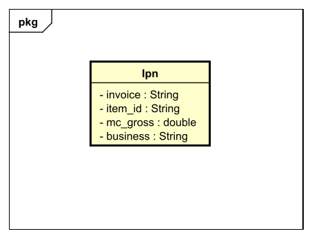

# Project "3A" Caruso&Fallica DSBD 2020
## Project for Distributed Systems Big Data 2020
### Made by:
- **Caruso Bartolomeo**
- **Giuseppe Fallica**

---

## 1. Aim of this project
This project aims at creating a microservice that will be used to handle payments for an e-commerce distributed application.

In order to develop this project we have used the following elements:
- **MySQL database:** relational database, used inside a Docker container 
- **Kafka messaging system:** open source distributed event streaming platform, used to publish into a specific topic errors and critical data information  
- **Spring framework:** an open source framework used to develop java based applications.

---

## 2. POJO classes
In order to easily generate messages and JSON data, we've used the following POJO classes:
- **Kafka Message & Kafka Value:**
  In our project we use Kafka to publish different kind of information into specific topics.
  All the messages have the same base structure made of a "message key", and a "message body", so we've created a base class for the message body called
  "KafkaValue" that is specialized into different kind of Values:
  * **KafkaErrorValue:** Value used for the messages published into "logging" topic, with a proper error key.
  * **KafkaHttpValue:** Value used for the messages published into "logging" topic, with key "http_errors".
  * **KafkaOrderValue:** Value used for the messages published into "orders" topic, with key "order_paid". 
  
  

- **Ipn & PaypalIpn:**
  In our project we have two different kind of services to handle ipn:
  * **Simulated Ipn:** this service is used to simulate the reception of an Ipn. 
  This service will use Ipn POJO class, that contains only the most important attributes of an Ipn.
    
  * **Real Ipn:** this service is used to receive a real Ipn, using Paypal sandbox service.
  For this we've used PaypalIpn POJO class, that contains all the attributes that a real Ipn could have.
  

- **Return Message:**
  

    
---

## 3. Kafka & Heartbeat

---

## 4. Payment controller & Payment service

---

## 5. Error handling

---

