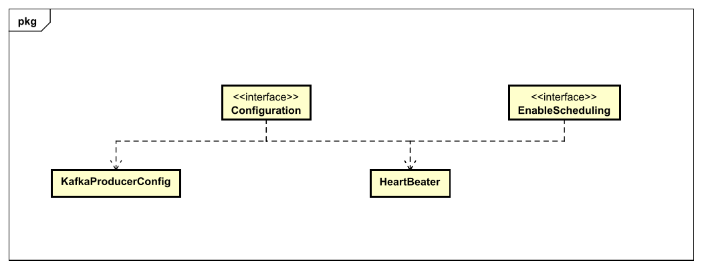

# Project "3A" Caruso&Fallica DSBD 2020
## Project for Distributed Systems Big Data 2020
### Made by:
- **Caruso Bartolomeo**
- **Giuseppe Fallica**

---

## 1. Aim of this project
This project aims at creating a microservice that will be used to handle payments for an e-commerce distributed application.

In order to develop this project we have used the following elements:
- **MySQL database:** relational database, used inside a Docker container 
- **Kafka messaging system:** open source distributed event streaming platform, used to publish into a specific topic errors and critical data information  
- **Spring framework:** an open source framework used to develop java based applications.

### How to test our microservice
- **Start docker:**
  ```bash
    $ docker start
  ```
- **Create a .env file inside "Progetto3ACarusoFallicaDSBD" with the following arguments:**
  ```dotenv
    DB_DATABASE = #Your DB name
    DB_USER = #Your DB user
    DB_PASSWORD = #Your DB password
    DB_ROOT_PASSWORD = #Your DB root password
    DB_HOST = #Your DB host name
    DB_PORT = #Your DB port number
    PAYMENT_MANAGER_HOST = #Host name of payment microservice, we used "paymentmanager" for that
    PAYMENT_MANAGER_PORT = #Payment microservice port
    MY_PAYPAL_ACCOUNT = #Receiver business mail, we used "merchange@mydomain.tld"
    HEART_BEAT_PERIOD = #Period of the heartbeating routine expressed in ms
    HEART_BEAT_URL_PING = #URL that will be used by the heartbeating routine for the POST request.
  ```
  
- **Open a terminal inside "Progetto3ACarusoFallicaDSBD" then use the following command:**
  ```bash  
  $ docker-compose up -build
  ```

---

## 2. POJO classes
In order to easily generate messages and JSON data, we've used the following POJO classes:
- **Kafka Message & Kafka Value:**
  in our project we use Kafka to publish different kind of information into specific topics.
  All the messages have the same base structure made of a "message key", and a "message body", so we've created a base class for the message body called
  "KafkaValue" that is specialized into different kind of Values:
  * **KafkaErrorValue:** value used for the messages published into "logging" topic, with a proper error key.
  * **KafkaHttpValue:** value used for the messages published into "logging" topic, with key "http_errors".
  * **KafkaOrderValue:** value used for the messages published into "orders" topic, with key "order_paid".
  
  

- **Ipn & PaypalIpn:**
  in our project we have two different kind of services to handle ipn:
  * **Simulated Ipn:** this service is used to simulate the reception of an Ipn. 
  This service will use Ipn POJO class, that contains only the most important attributes of an Ipn.
    
  * **Real Ipn:** this service is used to receive a real Ipn, using Paypal sandbox service.
  For this we've used PaypalIpn POJO class, that contains all the attributes that a real Ipn could have.
  

- **Return Message:**
  When a http error is generated, the HttpExceptionController captures it and generates a return message using this POJO class.
  

    
---

## 3. Kafka & Heartbeat
Our microservice uses Kafka messaging system to publish into two topics, different kind of system info:
* **Logging topic:** this topic is used to log all the error messages generated by our microservice.
  There are different kind of errors:
  **Received_wrong_business_paypal_payment:** this error message is generated by the service class when the ipn received by Paypal contains a wrong receiver business mail 
  **Bad_ipn_error:** this error message is generated by the service class when the received paypal request cannot be verified.
  **Http_error:** this error message is generated when the HttpExceptionController captures a http error.
* **Orders topic:** this topic is used to log all the messages with "order_paid" key. This kind of messages are generated when an ipn has been successfully verified and saved into the payment table of the database.

Information published by our microservice are ready to be consumed by other components that use Kafka.

The following UML diagrams shows the interfaces used for our "Heartbeater" and "KafkaProducerConfig" classes:

---

## 4. Payment controller & Payment service

---

## 5. Error handling

---

